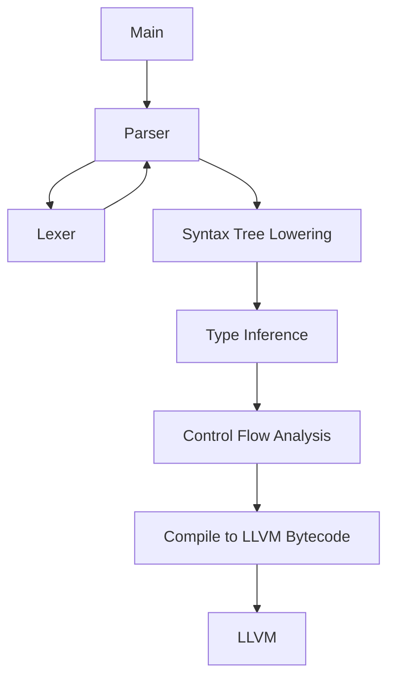

# UCVC
The Canonical Verdigris Compiler

---

## What is Verdigris?

**Verdigris** is a compiled, multi-paradigm, general purpose programming language, inspired heavily by both Rust and Haskell. Verdigris aims to be a language that can be used for both application development and systems programming, with an emphasis on functional language features.

## What is UCVC?

**UCVC** is the as-yet unnamed Canonical Verdigris Compiler. As the compiler is currently unfinished, and the Verdigris language does not yet have a specification, this document contains the most up-to-date information about the Verdigris language itself. UCVC will ultimately target LLVM bytecode once the remaining passes are finished.

## How does UCVC work?

The compiler itself is multi-pass, containing a generated lexer, a recursive descent parser, and a type checker based on an extended [Hindley-Milner](https://en.wikipedia.org/wiki/Hindley–Milner_type_system) inference algorithm. A control flow analysis pass for verifying the lifetime of values will be added before finally compiling to LLVM bytecode.

## Why does this exist?

I've become fascinated by compilers in the past couple years, and wanted to try creating my own for a relatively familiar language that still stretches the limits of my implementation knowledge. I have also been interested in haskell's type system, and wanted to experiment with something similar to that in a strictly evaluated language.

## Who made this?
I made this!
